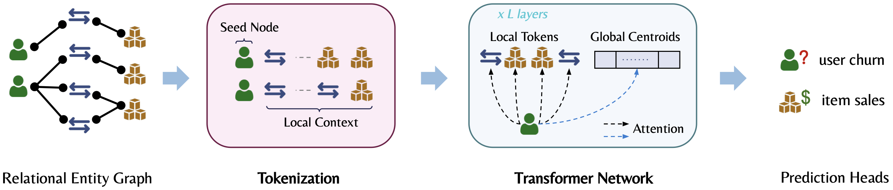

## Relational Graph Transformer (RelGT)

[](https://arxiv.org/abs/2505.10960)
>[Vijay Prakash Dwivedi](http://vijaydwivedi.com.np), [Sri Jaladi](https://www.linkedin.com/in/srijaladi), [Yangyi Shen](https://www.linkedin.com/in/yangyi-shen-232514264/), [Federico Lopez](https://fedelopez77.github.io), [Charilaos I. Kanatsoulis](https://sites.google.com/site/harikanats/), [Rishi Puri](https://www.linkedin.com/in/rishi-puri-1726b1147/), [Matthias Fey](https://rusty1s.github.io/#/), [Jure Leskovec](https://cs.stanford.edu/people/jure/)

This repository implements the [Relational Graph Transformer (RelGT)](https://arxiv.org/abs/2505.10960), the first graph transformer architecture specifically designed for multi-table relational data represented as heterogeneous temporal graphs.

# Overview



Relational Deep Learning (RDL) is a promising approach for building state-of-the-art predictive models on multi-table relational data. While Graph Neural Networks (GNNs) have been commonly used for this task, they struggle with capturing complex structural patterns and long-range dependencies. Our Relational Graph Transformer (RelGT) addresses the unique challenges of applying transformers to relational entity graphs through:

1. A novel multi-element tokenization strategy that decomposes each node into five components (features, type, hop distance, time, and local structure)
2. An architecture that combines local attention over sampled subgraphs with global attention to learnable centroids
3. Efficient encoding of heterogeneity, temporality, and topology without expensive precomputation

# Environment Setup

We provide environment setup instructions using Micromamba (a lightweight, faster alternative to Conda):

```
# Install Micromamba
mkdir ~/micromamba
wget -qO- https://micromamba.snakepit.net/api/micromamba/linux-64/latest | tar -xvj -C ~/micromamba
echo 'export PATH=~/micromamba/bin:$PATH' >> ~/.bashrc
source ~/.bashrc

# Create and activate environment
micromamba create -n gt python=3.12
micromamba activate gt

# Install PyTorch with CUDA
micromamba install pytorch torchvision torchaudio pytorch-cuda=12.1 -c pytorch -c nvidia

# Install uv for faster pip installations
curl -LsSf https://astral.sh/uv/install.sh | sh 

# Install PyTorch Geometric and its dependencies
uv pip install pyg-lib -f https://data.pyg.org/whl/torch-2.5.0+cu121.html
uv pip install torch-scatter torch-sparse torch-cluster torch-spline-conv -f https://data.pyg.org/whl/torch-2.5.0+cu121.html
micromamba install pyg -c pyg

# Install other dependencies
micromamba install -c conda-forge wandb absl-py tensorboard einops matplotlib progressbar pandas numba networkx scikit-network ipykernel tqdm
uv pip install kmeans-pytorch torchviz fastcluster opentsne ogb kmedoids relbench pytorch_frame[full] sentence-transformers h5py pynvml
```

# Experiments

To reproduce our experimental results on the RelBench benchmark:

```
# Choose the script to run specific experiment, for example:
bash expts/run-<experiment>.sh
```

**Notes**

- While the scripts are configured to run experiments optimally with 8 GPUs on NVIDIA A100 GPU (80GB) server, they can be adjusted according to specific user environments.
- Optionally, the main file supports Distributed Training using PyTorch's DDP, but may not be fully optimized.

# Citation

```bibtex
@article{dwivedi2025relational,
  title={Relational Graph Transformer},
  author={Dwivedi, Vijay Prakash and Jaladi, Sri and Shen, Yangyi and L{\'o}pez, Federico and Kanatsoulis, Charilaos I and Puri, Rishi and Fey, Matthias and Leskovec, Jure},
  journal={arXiv preprint arXiv:2505.10960},
  year={2025}
}
```
